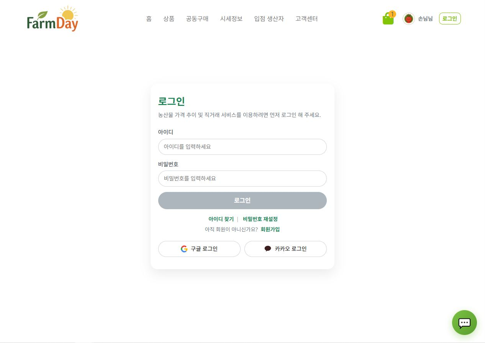
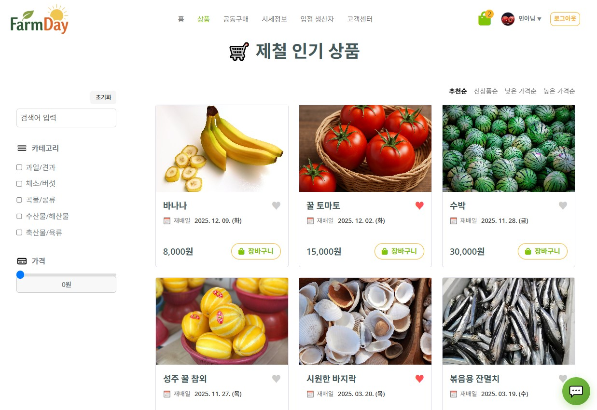
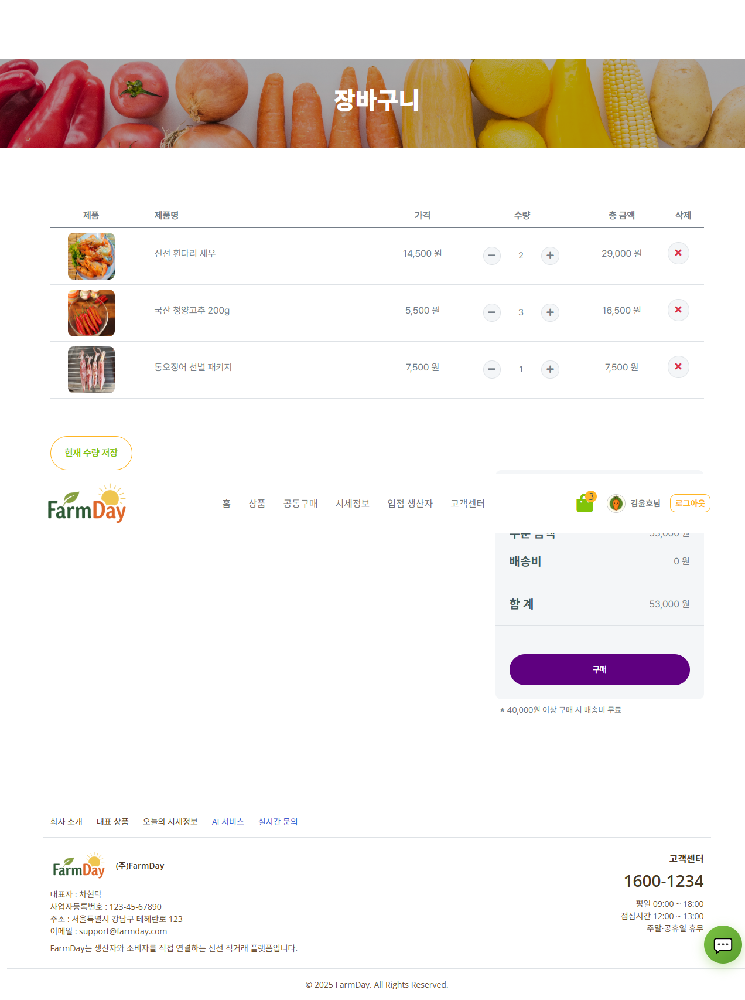

# 🌱 FarmDay – 농산물 직거래 & 시세 기반 커머스 플랫폼

FarmDay는 **농산물 시세 정보 + 직거래 + 공동구매**를 결합한  
생산자와 소비자를 직접 연결하는 웹 기반 커머스 플랫폼입니다.

소비자는 합리적인 가격으로 신선한 농산물을 구매할 수 있고,  
생산자는 중간 유통 없이 상품을 판매할 수 있도록 설계되었습니다.

---

## 📌 프로젝트 개요

- **프로젝트명**: FarmDay
- **개발 형태**: 팀 프로젝트
- **개발 기간**: 2025.11 ~ 2025.12
- **담당 역할**
  - 백엔드 핵심 도메인 구현
  - 관리자 페이지 전체 기능 구현
  - 결제 시스템(Toss Payments) 연동
  - 생산자 / 상품 / 주문 / 통계 기능 개발

---

## 🛠 기술 스택

### Backend
- Java 17
- Spring Boot
- Spring Security
- JWT 인증
- MyBatis
- Oracle XE
- Scheduler
- AWS S3

### Frontend
- React (Vite)
- Styled-components
- Axios
- Recharts / Chart.js
- SweetAlert2

### External API
- KAMIS 농산물 시세 API
- Toss Payments API
- OpenAI API
- Daum 주소 검색 API

---

## ✨ 주요 기능

---

## 👤 회원 / 인증

- 일반 회원 / 생산자 회원 분리 가입
- 이메일 인증 기반 회원가입
- JWT 기반 로그인
- Google / Kakao 소셜 로그인
- 이용약관 / 개인정보 처리 동의

  
<b>📸 회원 / 인증 화면 보기</b>

   

  | 로그인 | 회원가입 |
  |--------|----------|
  |  |  |

  | 이메일 인증 | 이용약관 |
  |-------------|----------|
  |  |  |

---

## 🏪 상품 & 스토어

- 상품 등록 및 조회
- 생산자 스토어 페이지
- 상품 상세 페이지
- AI 채팅 기반 상품 문의

  
<b>📸 상품 / 스토어 / AI 채팅 화면 보기</b>

   

  | 상품 페이지 | 상품 상세 |
  |-------------|-----------|
  |  |  |

  | 스토어 페이지 | AI 채팅 |
  |---------------|---------|
  |  |  |

---

## 🛒 장바구니

- 수량 증감
- 개별 상품 삭제
- 실시간 금액 계산
- 무료배송 조건 적용

  
<b>📸 장바구니 화면 보기</b>

   

  | 장바구니 |
  |----------|
  |  |

---

## 📦 주문 및 결제

- 주문 정보 확인
- 쿠폰 / 적립금 적용
- Toss Payments 결제 연동
- 결제 완료 처리

  
<b>📸 주문 / 결제 화면 보기</b>

   

  | 주문 페이지 | 결제 수단 |
  |-------------|-----------|
  |  |  |

  | QR 결제 | 결제 성공 |
  |---------|-----------|
  |  |  |

---

## 📊 시세 정보

- KAMIS API 연동
- 농산물 가격 등락 분석
- 급등 / 급락 품목 제공
- 구매 추천 메시지 출력

  
<b>📸 시세 정보 화면 보기</b>

   

  | 시세 메인 | 시세 상세 |
  |-----------|-----------|
  |  |  |

---

## 👨‍🌾 생산자 기능

- 생산자 회원 신청 및 승인
- 상품 등록 / 관리
- 판매 현황 확인

  
<b>📸 생산자 화면 보기</b>

   

  | 생산자 메인 | 상품 등록 |
  |-------------|-----------|
  |  |  |

  | 판매 내역 | 상품관리 |
  |-----------|-----------|
  |  |  |

---

## 🛠 관리자 페이지

- 관리자 로그인 / 회원가입
- 유저 관리 (차단 / 해제)
- 생산자 승인 관리
- 배너 / 공지 / 상품 관리
- 판매 통계 대시보드

  
<b>📸 관리자 화면 보기</b>

   

  | 대시보드 | 유저 관리 |
  |----------|-----------|
  |  |  |

  | 생산자 승인 | 상품 관리 |
  |-------------|-----------|
  |  |  |

  | 상품 통계 | 배너 관리 |
  |-----------|-----------|
  |  |  |

---

## 🔐 인증 & 보안

- Spring Security 기반 권한 분리
- JWT Access / Refresh Token
- 관리자 전용 API 분리
- 관리자 코드 기반 회원가입 제한

---

## 💳 결제 시스템

- Toss Payments API 연동
- 간편결제 / 카드결제 지원
- 결제 결과 검증 후 주문 확정 처리

---

## 📈 자체 평가

- 실제 서비스 수준의 전체 흐름 구현
- 관리자 페이지 포함한 실무 구조 경험
- 인증 / 결제 / 통계 핵심 기능 구현
- UI/UX 디테일 고려한 화면 설계

---

## 🔧 추후 개선 방향

- 관리자 일괄 처리 기능 강화
- 로그 / 이력 관리 시스템 도입
- 캐싱 및 성능 최적화
- 상품 추천 로직 고도화

---

## 👋 마무리

FarmDay는 단순 쇼핑몰이 아닌  
**데이터 기반 농산물 직거래 플랫폼**을 목표로 설계된 프로젝트입니다.

실제 서비스 흐름과 운영을 고려한 구조 설계를 통해  
백엔드 중심의 실무 역량을 강화할 수 있었습니다.
